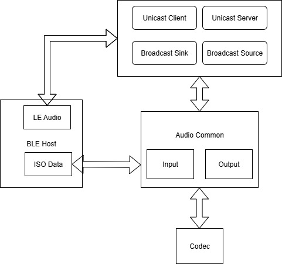
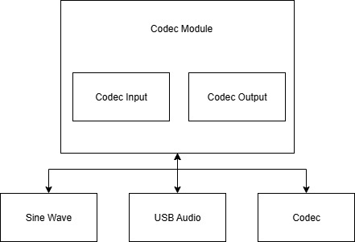
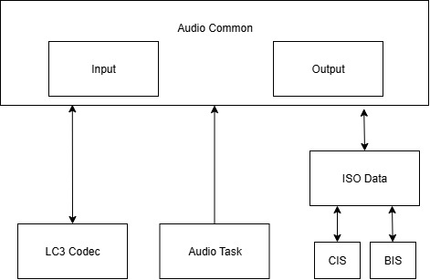

# LE Audio Audio Path

## 概述

LE Audio Audio Path(以下简称LEA音频通路)是基于当前SDK的音频通路架构实现的，主要为了测试LE Audio功能是否正常工作，并提供参考实现。

LEA音频通路的设计目标主要是提供一种兼容性较强，功能相对完整，可扩展性强，可靠性高的音频通路架构。音频链路的延迟等音频指标不在通用设计目标之内，因此LEA音频通路的设计目标主要是满足音频应用的需求。LE Audio相关项目的开发，需要优化音频通路设计，满足音频应用的需求。

## 架构设计

LE Audio架构分成三个部分：

- **音频通路任务**：包括Unicast Client(tlkmdi_lea_uc.c)、Unicast Server(tlkmdi_lea_us.c)、Broadcast Source(tlkmdi_leg_bms.c)和Broadcast Sink(tlkmdi_leg_bmr.c)。

- **通用音频通路**：包括音频输入(Audio Input)和音频输出(Audio Output)两个音频链路的数据处理。

- **音频驱动模块**: 主要是对于音频驱动的封装，包括音频输入和音频输出。



LE Audio的架构图如上图所示，Audio Common负责音频的输入输出处理，包括LC3编解码器初始化，音频数据的编解码，音频同步播放的处理。

Codec模块对于不同的音频输入输出方式，封装抽象统一的音频接口，例如UAC、Codec、A2DP In、Sine Wave等。

特定的音频任务模块，基于当前SDK的音频通路模式开发，目前支持了LE Audio典型的四种音频任务：Unicast Client、Unicast Server、Broadcast Source、Broadcast Sink。

### Codec 模块

Codec模块的逻辑框图如下图，主要将不同的音频输入实例化为统一的音频接口，并提供Codec打开、关闭、音频数据获取、音频数据发送等接口。



#### Codec 模块打开

Codec模块的初始化接口，主要分为Input和Output两个部分，分别对应音频的输入和输出。

- **Input Stream 初始化**：is_input_stream_init字段用于标识是否初始化了音频输入流，true表示初始化Input Stream，false表示未初始化。input_sample_rate表示音频输入的采样率，采样率直接采用LE Audio协议定义的参数。input_location表示音频输入的位置，目前仅支持左声道音频、右声道音频和立体声音频三种配置。

- **Output Stream 初始化**：is_output_stream_init字段用于标识是否初始化了音频输出流，true表示初始化Output Stream，false表示未初始化。output_sample_rate表示音频输出的采样率，采样率直接采用LE Audio协议定义的参数。output_location表示音频输出的位置，目前仅支持左声道音频、右声道音频和立体声音频三种配置。

```c
/**
 * @brief LE Audio Codec configuration structure.
 */
struct lea_codec_config {
    bool     is_input_stream_init;
    bool     is_output_stream_init;
    uint8_t  input_sample_rate;
    uint32_t input_location;
    uint8_t  output_sample_rate;
    uint32_t output_location;
};

/**
 * @brief       Initialize LE Audio codec stream.
 * @param[in]   config    - pointer to the codec configuration structure.
 * @return      none.
 */
void lea_codec_stream_init(struct lea_codec_config *config);
```

音频采样率的参数，目前仅支持8kHz、16kHz、24kHz、32kHz、48kHz这几种采样率，具体采样率的定义如下：
```c
// Audio Frame Frequency (for codec parameter)
enum lea_select_sampling_freq {
    LEA_SELECT_SAMPLING_FREQ_MIN,  /** < Minimum value for audio sampling frequency selection */
    LEA_SELECT_SAMPLING_FREQ_8000_HZ = 1,  /** < 8000 Hz */
    LEA_SELECT_SAMPLING_FREQ_11025_HZ = 2,  /** < 11025 Hz */
    LEA_SELECT_SAMPLING_FREQ_16000_HZ = 3,  /** < 16000 Hz */
    LEA_SELECT_SAMPLING_FREQ_22050_HZ = 4,  /** < 22050 Hz */
    LEA_SELECT_SAMPLING_FREQ_24000_HZ = 5,  /** < 24000 Hz */
    LEA_SELECT_SAMPLING_FREQ_32000_HZ = 6,  /** < 32000 Hz */
    LEA_SELECT_SAMPLING_FREQ_44100_HZ = 7,  /** < 44100 Hz */
    LEA_SELECT_SAMPLING_FREQ_48000_HZ = 8,  /** < 48000 Hz */
    LEA_SELECT_SAMPLING_FREQ_88200_HZ = 9,  /** < 88200 Hz */
    LEA_SELECT_SAMPLING_FREQ_96000_HZ = 10, /** < 96000 Hz */
    LEA_SELECT_SAMPLING_FREQ_176400_HZ = 11, /** < 176400 Hz */
    LEA_SELECT_SAMPLING_FREQ_192000_HZ = 12, /** < 192000 Hz */
    LEA_SELECT_SAMPLING_FREQ_384000_HZ = 13, /** < 384000 Hz */
    LEA_SELECT_SAMPLING_FREQ_MAX,  /** < Maximum value for audio sampling frequency selection */
};
```

音频输出位置的参数，目前仅支持LEA_LOCATION_FRONT_LEFT，LEA_LOCATION_FRONT_RIGHT和LEA_LOCATION_FRONT_LEFT | LEA_LOCATION_FRONT_RIGHT三种配置，具体配置的定义如下：
```c
/** < LE Audio Location Definitions */
enum lea_location_flag {
    LEA_LOCATION_NONE = 0x0000,
    LEA_LOCATION_FRONT_LEFT = 1U << 0,   /** < Front Left */
    LEA_LOCATION_FRONT_RIGHT = 1U << 1,   /** < Front Right */
    LEA_LOCATION_FRONT_CENTER = 1U << 2,   /** < Front Center */
    LEA_LOCATION_LOW_FREQUENCY_1 = 1U << 3,   /** < Low Frequency Effects 1 */
    LEA_LOCATION_BACK_LEFT = 1U << 4,   /** < Back Left */
    LEA_LOCATION_BACK_RIGHT = 1U << 5,   /** < Back Right */
    LEA_LOCATION_FRONT_LEFT_OF_CENTER = 1U << 6,  /** < Front Left of Center */
    LEA_LOCATION_FRONT_RIGHT_OF_CENTER = 1U << 7, /** < Front Right of Center */
    LEA_LOCATION_BACK_CENTER = 1U << 8,   /** < Back Center */
    LEA_LOCATION_LOW_FREQUENCY_2 = 1U << 9,   /** < Low Frequency Effects 2 */
    LEA_LOCATION_SIDE_LEFT = 1U << 10,  /** < Side Left */
    LEA_LOCATION_SIDE_RIGHT = 1U << 11,  /** < Side Right */
    LEA_LOCATION_TOP_FRONT_LEFT = 1U << 12,  /** < Top Front Left */
    LEA_LOCATION_TOP_FRONT_RIGHT = 1U << 13,  /** < Top Front Right */
    LEA_LOCATION_TOP_FRONT_CENTER = 1U << 14,  /** < Top Front Center */
    LEA_LOCATION_TOP_CENTER = 1U << 15,  /** < Top Center */
    LEA_LOCATION_TOP_BACK_LEFT = 1U << 16,  /** < Top Back Left */
    LEA_LOCATION_TOP_BACK_RIGHT = 1U << 17,  /** < Top Back Right */
    LEA_LOCATION_TOP_SIDE_LEFT = 1U << 18,  /** < Top Side Left */
    LEA_LOCATION_TOP_SIDE_RIGHT = 1U << 19,  /** < Top Side Right */
    LEA_LOCATION_TOP_BACK_CENTER = 1U << 20,  /** < Top Back Center */
    LEA_LOCATION_BOTTOM_FRONT_CENTER = 1U << 21,  /** < Bottom Front Center */
    LEA_LOCATION_BOTTOM_FRONT_LEFT = 1U << 22,  /** < Bottom Front Left */
    LEA_LOCATION_BOTTOM_FRONT_RIGHT = 1U << 23,  /** < Bottom Front Right */
    LEA_LOCATION_FRONT_LEFT_WIDE = 1U << 24,  /** < Front Left Wide */
    LEA_LOCATION_FRONT_RIGHT_WIDE = 1U << 25,  /** < Front Right Wide */
    LEA_LOCATION_LEFT_SURROUND = 1U << 26,  /** < Left Surround */
    LEA_LOCATION_RIGHT_SURROUND = 1U << 27,  /** < Right Surround */
    LEA_LOCATION_RESERVED = ((1U << 28) | (1U << 29) | (1U << 30) | (1U << 31)) /** < bit28 ~ bit29 */
};
```

#### Codec 模块关闭

Codec模块的关闭接口，主要用户Codec模块的资源释放。

```c
/**
 * @brief       Deinitialize LE Audio codec stream.
 * @return      none.
 */
void lea_codec_stream_deinit(void);
```

#### Codec 设置输出音量

Codec模块的设置输出音量接口，主要用于设置音频输出的音量。

```c
/**
 * @brief       Set output volume.
 * @param[in]   volume    - volume value to set.
 * @return      none.
 */
void lea_codec_set_output_volume(uint8_t volume)
```

#### Codec 不同实例定义

Codec模块默认定义了几种不同的实例，分别对应不同的音频输入输出方式。目前SDK支持Codec(不同芯片或者模组下对应不同硬件Codec驱动)、USB Audio(USB音频设备，需要Demo中打开UAC功能)、Sine Wave(生成音频信号，用于测试音频播放功能，只支持输入)。
```c
#define LE_AUDIO_CODEC_TYPE_NONE                0x00
#define LE_AUDIO_CODEC_TYPE_CODEC               0x01
#define LE_AUDIO_CODEC_TYPE_USB_AUDIO           0x02
#define LE_AUDIO_CODEC_SAMPLE_SINE_WAVE         0x03

#ifndef LE_AUDIO_CODEC_INPUT_TYPE
#define LE_AUDIO_CODEC_INPUT_TYPE LE_AUDIO_CODEC_TYPE_NONE
#endif

#ifndef LE_AUDIO_CODEC_OUTPUT_TYPE
#define LE_AUDIO_CODEC_OUTPUT_TYPE LE_AUDIO_CODEC_TYPE_NONE
#endif
```

用户可以根据需要，修改LE_AUDIO_CODEC_INPUT_TYPE的定义修改Input的类型，修改LE_AUDIO_CODEC_OUTPUT_TYPE的定义修改Output的类型。

#### Input 相关实例接口

音频输入清理当前所有未处理的输入数据，并将未处理的数据丢弃。
```c
/**
 * @brief       Clean input buffer.
 * @return      none.
 */
void lea_codec_input_clean_buffer(void);
```

音频输入使能和关闭
```c

/**
 * @brief       Initialize input stream.
 * @return      none.
 */
void lea_codec_input_stream_init(void);

/**
 * @brief       Deinitialize input stream.
 * @return      none.
 */
void lea_codec_input_stream_deinit(void);
```

判断当前音频未处理的音频数据的Sample数，如果拥有足够的数据，分别写入Left和Right的音频数据缓冲区。
Sample数只有音频采样率有关，和音频采样深度、音频通道数无关。
```c
/**
 * @brief       Get input audio data.
 * @param[out]  left_data    - pointer to left channel audio data buffer.
 * @param[out]  right_data   - pointer to right channel audio data buffer.
 * @param[in]   sample_num   - number of samples per channel to read.
 * @return      true if data is successfully read, false otherwise.
 */
bool lea_codec_input_get_audio_data(int16_t *left_data, int16_t *right_data, uint16_t sample_num);
```

#### Output 相关实例接口

音频输出使能和关闭
```c
/**
 * @brief       Initialize output stream.
 * @return      none.
 */
void lea_codec_output_stream_init(void);

/**
 * @brief       Deinitialize output stream.
 * @return      none.
 */
void lea_codec_output_stream_deinit(void);
```

音频输出设置音频数据，将特定数量的Sample数据写入音频输出缓冲区。Left Data是左声道音频数据，Right Data是右声道音频数据，Sample Num是Sample数。
```c
/**
 * @brief       Set output audio data.
 * @param[in]   left_data    - pointer to left channel audio data.
 * @param[in]   right_data   - pointer to right channel audio data.
 * @param[in]   sample_num   - number of samples per channel.
 * @return      none.
 */
void lea_codec_output_set_audio_data(int16_t *left_data, int16_t *right_data, uint16_t sample_num);
```

#### Input 和 Output 共同的实例接口

只有LE_AUDIO_CODEC_INPUT_TYPE和LE_AUDIO_CODEC_OUTPUT_TYPE选择相同的音频实例，并且音频任务同时启动输入和输出时，为了兼容有些Codec实例不支持输入和输出分开初始化，提供一个共同的初始化接口。

```c
/**
 * @brief       Initialize both input and output stream.
 * @return      none.
 */
void lea_codec_in_output_stream_init(void);

/**
 * @brief       Deinitialize both input and output stream.
 * @return      none.
 */
void lea_codec_in_output_stream_deinit(void);
```

### Audio Common 模块

该模块主要对于音频的使用场景进行了抽象，分为音频输入和音频输出两个方向，在不同的角度或者维度来看，音频输入可能刚好是呈现镜像。

- **注意：当前SDK的统一逻辑：从外部Codec采集原始音频，通过LC3编码器编码后，在通过LE Audio协议发送出去的行为称为音频输入；从LE Audio协议接收到编码数据，并通过LC3解码器解码后，在播放到外部Codec播放的行为称为音频输出**

四个典型的音频场景：

- **Broadcast Source**：广播源，只有音频采集并播放的行为，所以只有音频输入的功能。
- **Broadcast Sink**：广播接收器，只有接收BIS上的音频并播放的行为，所以只有音频输出的功能。
- **Unicast Client**：单播客户端，给已连接的设备，播放音乐的场景，只有音频输入的功能；双向通话的场景，同时有音频输入和输出的功能；单向麦克风音频采集的场景，只有音频输出的功能。
- **Unicast Server**：单播服务端，与Unicast Client的逻辑刚好相反。例如，播放音乐的场景，只有音频输出的功能。

Audio Common模块的逻辑框图如下图：



不同的Audio Task通过一些API配置当前音频场景下的音频功能和参数，Audio Common模块根据配置信息，初始化不同的LC3编解码器，并通过ISO Data模块获取和发送编码后的音频数据。

LE Audio的音频参数的结构体定义如下：

blocks：LC3编码器的块数，目前仅支持1。

location：音频的位置信息，用于标识音频的位置信息，目前仅支持左耳(0x01)，右耳(0x02)，立体声(0x03)。

samplingFrequency：音频采样率。

frameDuration：LC3编码器的帧时长，目前仅支持10ms(0x01)和7.5ms(0x02)。

frameOctets：LC3编码器的帧数据长度，单位为字节。

iso_handle：ISO Data模块的句柄，用于标识当前音频的ISO Data句柄。

presentationDelay：播放延迟，单位为微秒，目前仅在output上使用。

```c
struct lea_config { // refer to struct lea_bmr_config,
    uint8_t  blocks;
    uint32_t location;
    uint8_t  samplingFrequency;
    uint8_t  frameDuration;
    uint16_t frameOctets;

    uint16_t iso_handle;
    uint32_t presentationDelay;
};
```

#### Input 相关接口

初始化Input相关的配置信息，主要是Audio Common内部使用的配置信息。

```c
/**
 * @brief       Initialize LE Audio input configuration cache.
 * @return      none.
 */
void lea_input_config_initial(void);
```

设置和释放Input相关的配置信息，必须要在lea_set_input_config之前配置完成，主要是分配LC3编解码器的数量和空间。
```c
/**
 * @brief       Configure LC3 encoder workspace for all input locations.
 * @param[in]   location    - bitmap of LE Audio locations.
 * @return      0 on success, negative value otherwise.
 */
int lea_set_input_all_location(uint32_t location);

/**
 * @brief       Release LC3 encoder workspace allocated for input.
 * @return      0 on success, negative value otherwise.
 */
int lea_release_input_location(void);

/**
 * @brief       Program input sampling count and interval based on BAP config.
 * @param[in]   frequency   - LC3 sampling frequency selector.
 * @param[in]   duration    - LC3 frame duration selector.
 * @return      none.
 */
void lea_set_input_sample_config_bap(uint8_t frequency, uint8_t duration);
```

打开和关闭Input功能。

```c
/**
 * @brief       Enable audio input path and reset acquisition timer.
 * @param[in]   get_time    - reference timestamp (optional).
 * @return      none.
 */
void lea_open_input(uint32_t get_time);

/**
 * @brief       Disable audio input path and clear ASE state.
 * @return      none.
 */
void lea_close_input(void);
```

初始化和释放特定ISO通道的配置。

```c
/**
 * @brief       Store ASE specific input configuration and start LC3 encoder.
 * @param[in]   p_config    - pointer to ASE configuration.
 * @return      none.
 */
void lea_set_input_config(const struct lea_config *p_config);

/**
 * @brief       Remove stored input configuration for specific ISO handle.
 * @param[in]   iso_handle  - ISO connection handle.
 * @return      none.
 */
void lea_release_input_config(uint16_t iso_handle);
```

#### Output 相关接口

Output的接口和Input完全相同，简单的镜像关系。

### Audio Task 模块

Audio Task目前支持四个LE audio的场景，每个场景对应的源代码如下：

- **Broadcast Source**：(tlkmdi_le_bms.c) Broadcast Media Sender(BMS) 广播音乐发射器，只需要播放音乐，不需要接收音频。

- **Broadcast Sink**：(tlkmdi_le_bmr.c) Broadcast Media Receiver(BMR) 广播音乐接收器，只需要接收音频，不需要播放音乐。

- **Unicast Client**：(tlkmdi_le_uc.c) Unicast Client 单播客户端，基于LE Audio协议，支持连接TWS和Headset耳机，播放音乐或双向通话等场景。

- **Unicast Server**：(tlkmdi_le_us.c) Unicast Server 单播服务端，基于LE Audio协议，支持连接手机或者标准UC设备，播放音乐和双向通话等场景。

关于Audio Task的解释，可以参考Handbook中的相关章节。
