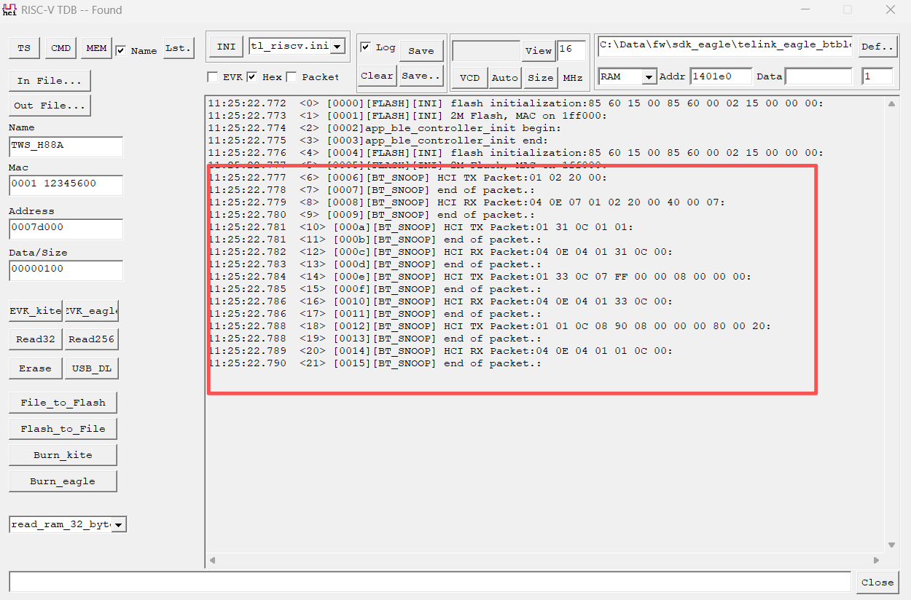
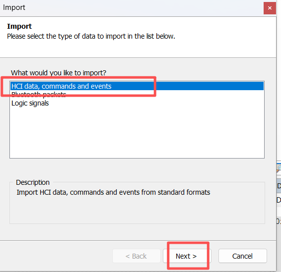
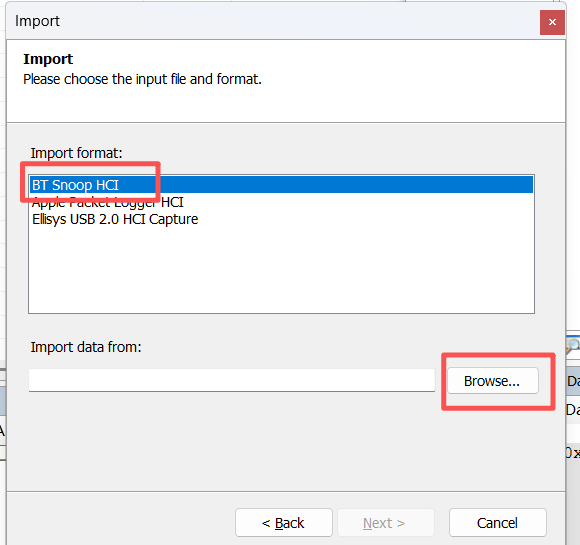
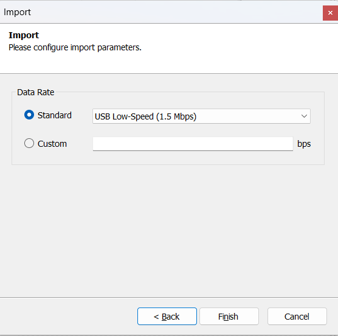
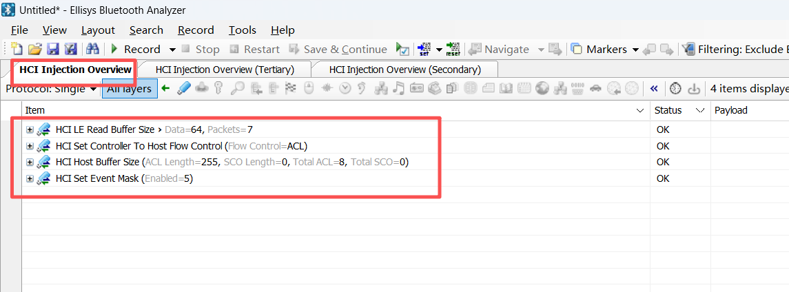
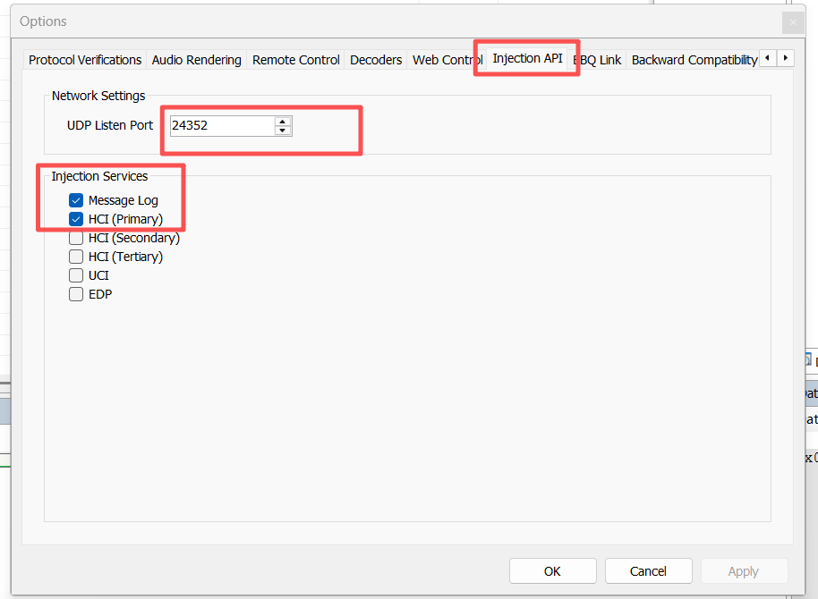
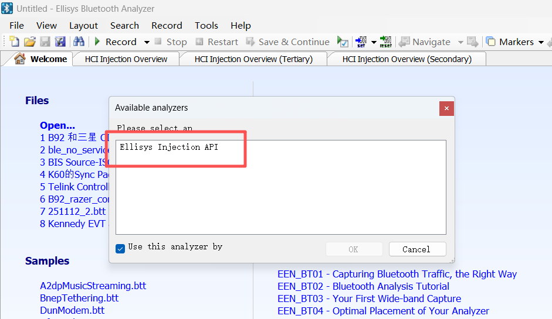
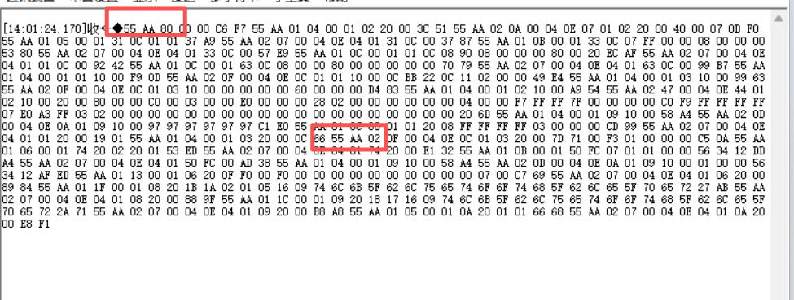
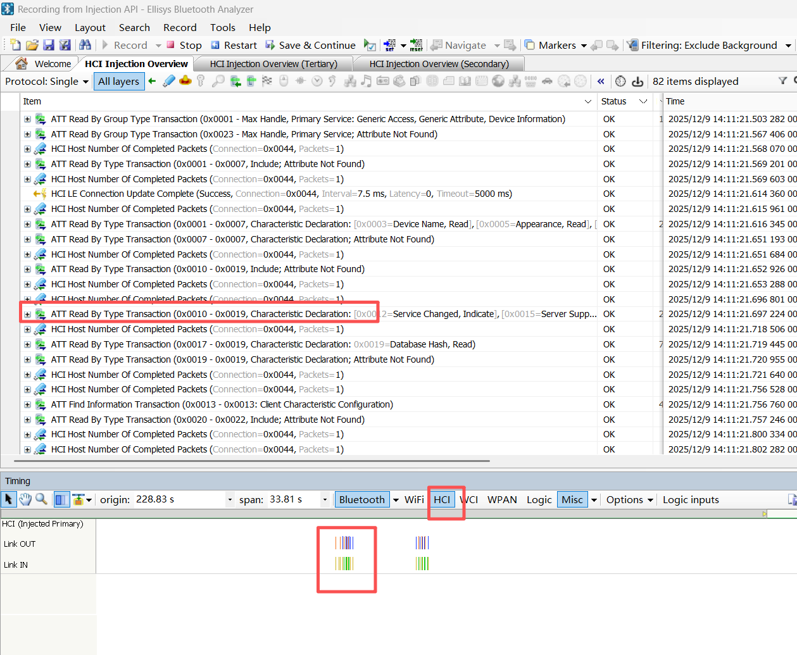

# Btsnoop 调试工具使用说明

Btsnoop是一种记录蓝牙协议栈数据交换的通信协议，在分析蓝牙问题时有很大用途，能够帮助开发者快速定位到问题，当然对于下学习蓝牙协议栈也有很大用途。

该 SDK 基于调试方便，集成了 Btsnoop 功能，并提供多种方式供用户选择。

## 软硬件准备

- 硬件：UART 转 USB的模块
- 软件：Ellisys 软件(Wireshark、Frontline等软件也可以)
- 软件：Python 3.7+
 
**注：推荐使用 Ellisys 软件， 增强 BTSNOOP 日志只有 Ellisys 支持，解释也默认以 Ellisys 软件为准。**

Python 3.7+ 需要的一些必要的依赖，需要自行安装，如果遇到问题可以参考官方文档或者咨询AI。

必须模块安装依赖：
python -m pip install pyserial
python -m pip install construct

## 软件配置

打开宏定义BLUETOOTH_SNOOP_LOG_ENABLE，就会开启 Btsnoop 日志记录功能。

```c
#ifndef BLUETOOTH_SNOOP_LOG_ENABLE
#define BLUETOOTH_SNOOP_LOG_ENABLE 0
#endif
```

默认Btsnoop日志是关闭的，并且默认是增强型 Btsnoop 日志，如果想要普通日志模式，可以修改宏 BLUETOOTH_SNOOP_ENHANCED_ENABLE 为 0。

增强型 Btsnoop 日志可以修改 BLUETOOTH_SNOOP_ENHANCED_WAIT 为 1，这样日志是同步输出方式，不会有数据丢失。

## 普通 Btsnoop 日志

普通模式只需要将宏定义修改为下面的数据，就可以开启。日志的输出方式默认通过USB，需要通过 RISC-V TDB 工具接收。

```c
#ifndef BLUETOOTH_SNOOP_LOG_ENABLE
#define BLUETOOTH_SNOOP_LOG_ENABLE 1
#endif

#define BLUETOOTH_SNOOP_ENHANCED_ENABLE 0
#define BLUETOOTH_SNOOP_ENHANCED_WAIT   0
```

通过USB输出日志，容易出现数据丢失的情况，可以尝试加大USB日志缓存大小，宏定义TLK_DEBUG_LOG_MEM_POOL_SIZE。具体的可以参考Handbook。

打开日志后，可以通过USB看到Btsnoop的日志输出，如下图所示。



需要把日志保存到本地，文件名默认是同路径下的 'btsnoop_test_log.txt', 用户可以修改python脚本中内的代码，指定日志文件名。

代码如下：

```python
    btsnoop = BtSnoop('test', 'output')
    btsnoop.create_file()
    # btsnoop.log_packet(HCI_ACL_DATA_PACKET, 0, acl_packet, current_time)
    # btsnoop.log_packet(HCI_ACL_DATA_PACKET, 1, acl_packet, current_time)
    get_btsnoop_data("btsnoop_test_log.txt")
```

之后运行python脚本即可，命令如下：

```
python btsnoop_usb.py
```

运行后，会再同级目录下，新建output文件夹，文件名称为test.cfa.

**打开方式**：

使用 Ellisys 软件，点击 'File' -> 'Import'，或者快捷键 'Ctrl+P'，打开如下界面。



按照图片中的提示，选择刚才保存的日志文件，点击 'Finish' 按钮。





打开后，可以看到日志内容。

再 Ellisys 的 'HCI Injection Overview' 页面，可以看到 HCI 日志。类似的如下图所示。



**test.cfa 是标准的Btsnoop日志文件，除了 Ellisys 软件，可以使用其他支持的软件打开**，如 Wireshark、Frontline 等。

这种方式日志不能实时刷新，基本已经处于半废弃状态，仅作为新芯片未适配 增强型 Btsnoop 日志的临时方案。不推荐开发者使用

## 增强型 Btsnoop 日志

增强型 Btsnoop 日志，依赖与 Ellisys 软件，以及 UART 转 USB 模块。

### 软件准备

下载并安装 Ellisys 软件，并打开。

点击 'Tools' -> 'Options'，打开后选择 'Injection API' 选项。界面如下图所示：确认 'UDP Listen Port' 选项的端口号为 24352。（软件默认端口号为 24352，如果修改了端口号，需要在这里修改）

并确保选择了 'Message Log' 和 'HCI(Primary)’ 两个选项。



如果选择了这两选择后，点击 'Record' 按钮，会出现如下界面，多了一个 'Ellisys Injection API' 的虚拟设备，选择后就可以抓取到 Btsnoop 日志。



**注：如果有Ellisys硬件，可以直接选择硬件，'Ellisys Injection API'是默认设备，可以与硬件同时抓取日志**

### 代码配置

打开BLUETOOTH_SNOOP_ENHANCED_ENABLE宏定义，开启增强型 Btsnoop 日志。

查看当前板子的 UART TX 引脚，并连接到 UART 转 USB 模块。

波特率默认是3Mbps，如果硬件模块不支持，可以修改宏定义 BT_SNOOP_SERIAL_BAUDRATE。

```c
#define BT_SNOOP_SERIAL_BAUDRATE   3000000
```

可以使用通用的UART调试工具，查看有没有类似 'AA 55' 的数据，如果有，则说明 UART 转 USB 模块已经正确连接。



脚本中，修改波特率的方式如下：

```python
    selected_port = list_serial_ports()
    if selected_port:
        read_from_serial(selected_port, 3000000)
```

使用命令运行 python 脚本，命令如下：

```
tlk_bluetooth_src\tlkmw\btble\shell>python btsnoop_uart.py
可用串口列表：
  [0] COM4 (USB Serial Port (COM4))
请输入要打开的串口编号 (0 - 0): 0
📡 Listening on COM4
```

选择想要监控的串口既可以。

程序每次上电，会默认发送一些初始化信息，如下所示。

```
📡 Listening on COM4
pkg_type=80, data_len=0, data=, recv_crc=F7C6, calc_crc=F7C6
🔄 Reset command received. Clearing BTSnoop log...
pkg_type=01, data_len=4, data=01022000, recv_crc=513C, calc_crc=513C
➡️ TX packet: HCI type=01, len=3
pkg_type=02, data_len=10, data=040e0701022000400007, recv_crc=F00D, calc_crc=F00D
⬅️ RX packet: HCI type=04, len=9
pkg_type=01, data_len=5, data=01310c0101, recv_crc=A937, calc_crc=A93
```

有日志打印，说明运行正常。

### 日志查看

日志会再 'HCI Injection Overview' 页面显示，时间是当前系统运行的时间（只测试过北京时间）。

在 'Timing' 界面，选择HCI功能，就能在下面看到 HCI 日志，可以配合其他工具一起看时序。

下图是抓的 ACL连接的日志，可以看到ACL交换的流程。




**BLE Host 默认开启了Host端流控，会导致很多 'HCI Host Number of Completed Packets' 的日志，可以忽略。**

或者在BLE Host初始化完成后，调用如下接口关闭该功能，调试阶段。

该功能是为了防止Host端被 Delay后，controller端一直上报ACL Data，导致buffer溢出，数据丢失。正常开发时，可以关闭。

```c
ble_host_hci_acl_data_enable_flow(false, 8);
```
