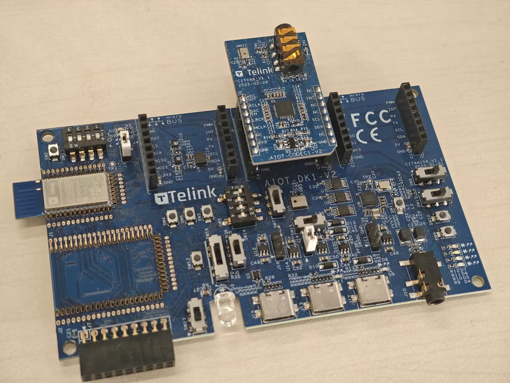
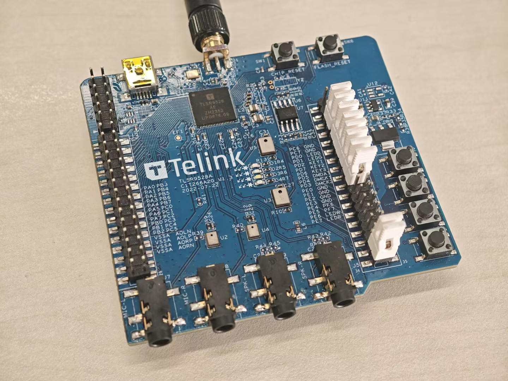
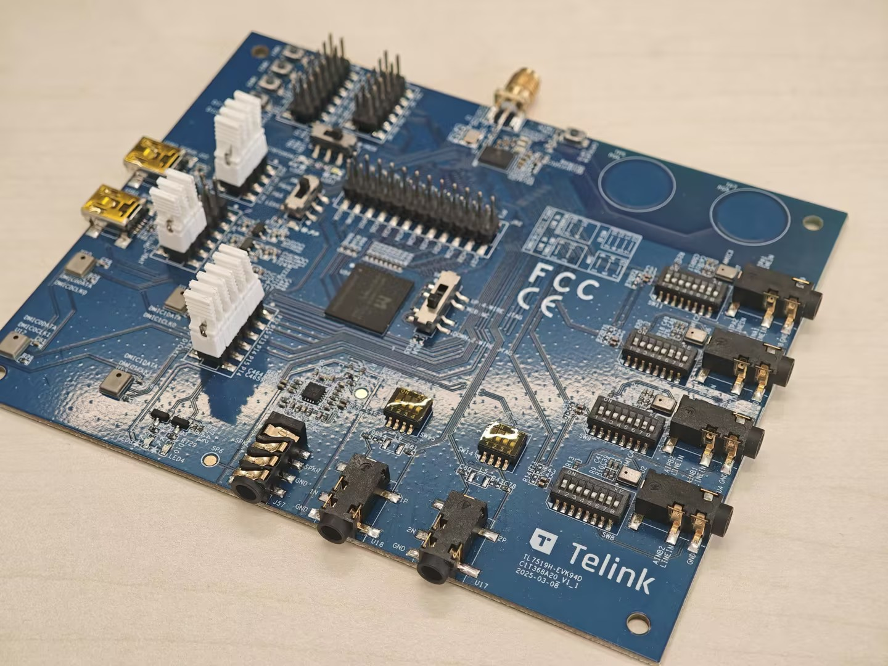
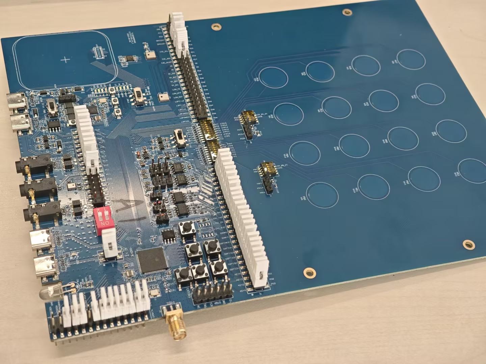

# 概述

BLE example 工程全部统一的配置，模块化的管理方式，方便开发者快速验证，使用以及新建不同的单BLE应用示例。工程通过 "app_example.h"文件来实现不同应用的配置，以及实现用户层实现。

## 支持的硬件

目前工程支持以下硬件平台:

| MCU Series | Board Model                                                    |
|------------|----------------------------------------------------------------|
| TL721x     | C1TXA104_V1.1(CODEC1-V2)    <br>  C1T315A20  <br> C1T315A20_V2 |
| TLSR952x   | C1T266A20_V1.3   <br>                                          | 
| TL751x     | C1T368A20_V1_1   <br>                                          | 
| TL322x     | C1T371A20_V1_1   <br>  C1T379A20_V1_0                          |

下面是各硬件平台的示意图：

### TL721x - AIOT board


### B92 - C1T266A20_V1.3


### TL751x - C1T368A20_V1_1


### TL322x - C1T371A20_V1_1


## 目录结构

```
vendor/ble_example/
├── app_example.h                    # 工程管理
├── app_config.h                     # 工程通用配置
├── app_create_new_demo/             # 应用示例目录
│   ├── app_create_new_demo.c        # 应用示例源代码
│   ├── app_create_new_demo_cfg.h    # 应用特殊配置
│   └── README.md                    # 应用的说明文档
├── app_key.c                        # 按键处理函数
├── app_key.h
└── main.c                           # 工程入口
```

### main.c

main.c 是工程的入口，主要完成了以下工作：

1. 初始化系统，包括初始化系统的一些基础资源，如系统定时器，系统事件，系统任务等；
2. 启动系统，启动系统的主要任务，包括初始化蓝牙协议栈，启动蓝牙协议栈的主循环，启动系统的其他任务等；
3. 进入系统的主循环，在循环中不断处理系统的事件，包括系统定时器事件，系统事件等；

如下面代码中，通过APP_DEMO_SELECT宏定义的选择，进入不同的应用示例来实现不同的功能。

```c
int INIT(APP_DEMO_SELECT)(void);
void tlkapp_host_le_init(void)
{
    ble_stack_init();
    INIT(APP_DEMO_SELECT)();
}

int START(APP_DEMO_SELECT)(void);
void tlkapp_host_le_start(void)
{
    START(APP_DEMO_SELECT)();
}

int main(void)
{
    tlksys_init();
    tlksys_start(tlkapp_create_allTasks);

#if (!TLK_CFG_RTOS_ENABLE)
    while (1) {
    #if (BLE_CONTROLLER_INITIAL_EN)
        tlk_sys_main_loop();
    #endif
        tlksys_handler();
    }
#endif

    return 0;
}
```

### app_key.h and app_key.c

app_key.h 和 app_key.c 实现了按键处理函数，用户可以根据自己的需求注册按键处理函数，当按键被按下时，会调用相应的回调函数。

按键Key ID默认的定义如下：

| Key ID | Description | Key ID | Description        |
|--------|-------------|--------|--------------------|
| 0      | Key 1 click | 4      | Key 1 double click |
| 1      | key 2 click | 5      | Key 2 double click |
| 2      | Key 3 click | 6      | Key 3 double click |
| 3      | Key 4 click | 7      | Key 4 double click |

用户可以根据需求修改按键的定义，也可以在app_key.c中实现按键的处理函数。

```c
/**
 *    @brief  Register a callback function for a specific key.
 *
 *    @param[in] key_id    Key ID.
 *    @param[in] callback  Callback function to be called when the key is pressed.
 *
 *    @return void
 */
void app_key_register_callback(uint8_t key_id, void (*callback)(void));
```

### app_config.h

app_config.h 定义了工程的通用配置，包括系统的一些基础配置，蓝牙协议栈的一些基础配置，以及应用的一些基础配置。通常情况下，用户不需要修改该文件。

### app_example.h

app_example.h 为整个工程提供了通用的管理方式，用户可以根据自己的需求选择不同的应用示例，并且不同的应用示例配置一些独特的配置，实现不同应用不同配置。

下面截取了实现的核心代码，文件提供了三个宏定义，分别是START、INIT和IS_DEMO_SELECTED，并且为每个应用示例提供了独特的宏定义，比如APP_BLE_NEW_DEMO，APP_BLE_ADV，APP_BLE_ACL。

```c
#define START(...)                      EXPAND(START_(__VA_ARGS__))
#define INIT(...)                       EXPAND(INIT_(__VA_ARGS__))
#define IS_DEMO_SELECTED(...)           (GET_DEMO_ID(APP_DEMO_SELECT) == GET_DEMO_ID(__VA_ARGS__))

// 
#define APP_BLE_NEW_DEMO                app_new_demo, 1
// Simple BLE demo
#define APP_BLE_ADV                     app_adv, 100
#define APP_BLE_ACL                     app_acl, 101

// develop can not commit this select to gitlab.
#define APP_DEMO_SELECT                 APP_BLE_NEW_DEMO
```

- **INIT**: 初始化函数，该函数会在系统初始化时被调用，用户可以在该函数中实现一些初始化工作，主要是蓝牙协议栈一些差异配置。
- **START**: 启动函数，该函数会在系统启动时被调用，用户可以在该函数中实现一些启动工作，如启动广播，扫描，启动应用示例等。
- **IS_DEMO_SELECTED**: 判断是否选择了某个应用示例，该宏会根据APP_DEMO_SELECT和传入的应用示例宏，判断是否选择了该应用示例，主要为一些通用功能提供选择，例如tlkusb_debug_shell_hook属于SDK通用功能，可能在不同的应用示例中都需要，所以需要通过该宏来判断是否选择了该功能。
- **APP_BLE_NEW_DEMO**: 应用示例宏，该宏定义了新应用示例，主要由示例的名称和ID。其中ID在IS_DEMO_SELECTED会使用到，需要保证ID的唯一性。
- **APP_DEMO_SELECT**: 选择的应用示例，该宏定义了当前选择的应用示例，在main.c中会根据该宏选择对应的应用示例。

其中，START、INIT和IS_DEMO_SELECTED三个宏定义，是通过宏展开的方式实现的，如想要了解，自行阅读代码或者咨询AI即可。

```c
#if __has_include(CFG_PATH(APP_DEMO_SELECT))
#include CFG_PATH(APP_DEMO_SELECT)
#endif

#define STRINGIFY_HELPER(x)             #x
#define STRINGIFY(x)                    STRINGIFY_HELPER(x)

#define START(...)                      EXPAND(START_(__VA_ARGS__))
#define INIT(...)                       EXPAND(INIT_(__VA_ARGS__))
#define IS_DEMO_SELECTED(...)           (GET_DEMO_ID(APP_DEMO_SELECT) == GET_DEMO_ID(__VA_ARGS__))

#define CAT(a, b)                       a##b
#define EXPAND(x)                       x
#define EVAL(x)                         EXPAND(x)
#define TOSTRING(x)                     STRINGIFY(x)
#define CFG_PATH_(x, id)                TOSTRING(EVAL(CAT(x/x,_cfg.h)))
#define CFG_PATH(...)                   EXPAND(CFG_PATH_(__VA_ARGS__))
#define INIT_(x, id)                    EVAL(CAT(x, _init))
#define START_(x, id)                   EVAL(CAT(x, _start))
#define GET_DEMO_ID_(x, id)             id
#define GET_DEMO_ID(...)                GET_DEMO_ID_(__VA_ARGS__)
```

### app_create_new_demo/

app_create_new_demo/ 目录下提供了一些应用示例，用户可以根据自己的需求新建不同的应用示例，并且可以根据自己的需求实现不同的功能。

**注意**: 如果文件夹需要有特殊的配置文件，文件夹的名称必要要和工程宏定义的名称相同，配置文件的名称必须要_cfg.h结尾，实现逻辑参考app_example.h的实现。

```c
#include "stack/ble/ble.h"

#include "../app_example.h"

int INIT(APP_BLE_NEW_DEMO)(void)
{
    tlk_printf("Hello, Telink BLE Demo initialized!");
    return 0;
}

void START(APP_BLE_NEW_DEMO)(void)
{
    tlk_printf("Hello, Telink BLE Demo started!");
}
```

必须要实现的两个函数分别是INIT和START，INIT函数会在系统初始化时被调用，START函数会在系统启动时被调用。如APP_BLE_NEW_DEMO示例，实现了初始化和启动的打印信息。

## 如何新建应用示例

### 注册Demo到app_example.h

1. **定义 Demo 宏**
   
   在文件中的 Demo 定义区域添加新 Demo 的宏定义：
   ```c
   #define APP_BLE_MY_DEMO    app_my_demo, 500
   ```
   
   **格式说明**：
   - `APP_BLE_MY_DEMO`：Demo 的宏名称（建议全部使用大写）
   - `app_my_demo`：Demo 的实际名称（与文件夹名一致）
   - `500`：Demo 的唯一 ID（确保不与现有 Demo ID 冲突）
   
   **ID 分配规则**：
    - 通用 BLE Demo：100-199
    - LE Audio Demo：200-299
    - 特定客户 Demo：1000-1099

2. **选择APP_BLE_MY_DEMO**
   
   修改 `APP_DEMO_SELECT` 宏，指向新创建的 Demo：
   ```c
   #define APP_DEMO_SELECT    APP_BLE_MY_DEMO
   ```

### 新建 app_my_demo 文件夹

在 `vendor/ble_example` 目录下创建以 app_my_demo 名称命名的文件夹。

```
vendor/ble_example/app_my_demo/
```

**注意事项**：
- 文件夹名称建议使用小写字母和下划线。
- 文件夹名称将作为 Demo 标识符使用。

### 新建文件

在新建的app_my_demo文件夹中创建以下文件：

1. **主实现文件**（必需）
   - 文件名：`{demo_name}.c`
   - 示例：`app_my_demo.c`
   - 用途：实现 Demo 的主要功能代码

2. **配置文件**（可选，如需要协议栈配置）
   - 文件名：`{demo_name}_cfg.h`
   - 示例：`app_my_demo_cfg.h`
   - 用途：配置协议栈相关参数

3. **说明文档**（可选）
   - 文件名：`README.md`
   - 用途：记录 Demo 的功能说明和使用方法

### 实现基本函数

在 Demo 的主实现文件中，必须实现以下两个函数：

```c
#include "stack/ble/ble.h"
#include "../app_example.h"

// 初始化函数
int INIT(APP_BLE_MY_DEMO)(void)
{
    // 初始化相关资源
    tlk_printf("My Demo initialized!");
    return 0;  // 返回 0 表示初始化成功
}

// 启动函数
void START(APP_BLE_MY_DEMO)(void)
{
    // Demo 的主逻辑入口
    tlk_printf("My Demo started!");
    // 在这里启动 Demo ，如打开扫描，打开广播
}
```

**函数说明**：
- `INIT()` 函数：在系统启动时调用，用于初始化 Demo 所需的资源
  - 返回值：`0` 表示成功，非 `0` 表示失败
- `START()` 函数：在初始化完成后调用，是 Demo 的主逻辑入口

**宏展开机制**：
- `INIT(APP_BLE_MY_DEMO)` 会自动展开为 `app_my_demo_init()`
- `START(APP_BLE_MY_DEMO)` 会自动展开为 `app_my_demo_start()`

### 编译和运行

完成以上步骤后，即可编译和运行新创建的 APP_BLE_MY_DEMO:

1. 确保 `app_example.h` 中的 `APP_DEMO_SELECT` 指向新 Demo
2. 编译工程
3. 下载固件到设备
4. 运行并验证功能


## 现有参考Demo说明

工程提供了很多参考 Demo，方便用户快速验证和使用。下面是各 Demo 的功能说明：

**BLE New Demo**:

实现了一个空的 BLE 应用示例，可以验证平台和芯片的基本功能，类似于经典的hello world。具体的demo说明参考[README.md](app_create_new_demo/README.md)

**BLE ADV Demo**:

实现了传统广播的功能，可以用来验证传统广播的效果。具体的demo说明参考[README.md](app_adv/README.md)

**BLE ACL Demo**:

实现了 BLE ACL的功能，主从一体的 BLE 设备，可以与智能手机实现主从通信。具体的demo说明参考[README.md](app_acl/README.md)

**BLE ACL Peripheral Demo**:

实现了 BLE ACL Peripheral 的功能，可以用来验证 BLE Peripheral 设备的功能。具体的demo说明参考[README.md](app_acl_peripheral/README.md)

**BLE ACL Central Demo**:

实现了 BLE ACL Central 的功能，可以用来验证 BLE Central 设备的功能。具体的demo说明参考[README.md](app_acl_central/README.md)

**BLE OTA Demo**:

实现了 BLE OTA 的功能，可以用来验证 BLE OTA 升级的功能。具体的demo说明参考[README.md](app_ota_ble/README.md)

**BLE SMP Demo**:

实现了 BLE SMP 的功能，可以用来验证 BLE SMP 加密的功能，该Demo是基于BLE ACL的扩展，可以验证不同的SMP加密方式。具体的demo说明参考[README.md](app_acl_smp/README.md)

**BLE Random Address Demo**:

实现了 BLE Random Address 的功能，可以用来验证 BLE 静态随机地址，可解性随机地址和非可解析随机地址的功能。具体的demo说明参考[README.md](app_acl_random_addr/README.md)

**BLE HID Device Demo**:

实现了 BLE HID Device 的功能，集成了BLE Keyboard和BLE Mouse，可以用来验证 BLE HID 设备的功能。具体的demo说明参考[README.md](app_hid_device/README.md)

**BLE Scan Demo**:

实现了 BLE Scan 的功能，包括传统扫描和扩展扫描，可以用来验证 BLE 扫描的功能。具体的demo说明参考[README.md](app_scan/README.md)

**BLE SPP Server Demo**:

实现了 BLE SPP Server 的功能，可以用来验证 BLE SPP Server 的功能。具体的demo说明参考[README.md](app_spp_server/README.md)

**BLE SPP Client Demo**:

实现了 BLE SPP Client 的功能，可以用来验证 BLE SPP Client 的功能。具体的demo说明参考[README.md](app_spp_client/README.md)

**BLE SSDP Demo**:

实现了 BLE SSDP(simple service discovery protocol) 的功能，可以用来验证 BLE SSDP 的功能,该Demo和BLE SPP Client Demo功能一样，只是调用的接口不同。具体的demo说明参考[README.md](app_ssdp/README.md)

**BLE iOS ANCS Demo**:

实现了 BLE iOS ANCS(Apple Notification Center Service) 的功能，应用中提供了判断是否为iOS设备的方式，以及可以订阅iOS的通知。具体的demo说明参考[README.md](app_ios_ancs/README.md)

**BLE L2CAP CoC Demo**:

实现了 BLE L2CAP CoC (Connection Oriented Channel) 的功能，可以用来验证 BLE L2CAP CoC 的功能。具体的demo说明参考[README.md](app_l2cap_coc/README.md)


**LE Audio Unicast Server Demo**:

实现了 LE Audio Unicast Server 的功能，可以用来验证 LE Audio 单播的功能，可以与支持LE Audio的手机实现LE Audio音频播放。具体的demo说明参考[README.md](app_lea_us/README.md)

**LE Audio Unicast Client Demo**:

实现了 LE Audio Unicast Client 的功能，可以用来验证 LE Audio 单播的功能，可以与LE Audio Unicast Server实现LE Audio音频播放，包括音乐播放，双向通话，单麦克风功能。具体的demo说明参考[README.md](app_lea_uc/README.md)

**LE Audio Source Demo**:

实现了 LE Audio Source 的功能，标准的LE Audio 单播Client，可以通过上位机与标准LE Audio设备实现音频播放，包括音乐播放，双向通话。具体的demo说明参考[README.md](app_lea_source/README.md)

**LE Audio Auracast(Broadcast) Source Demo**:

实现了 LE Audio Auracast(Broadcast) Source 的功能，可以用来验证 LE Audio 广播的功能。具体的demo说明参考[README.md](app_lea_broadcast_source/README.md)

**LE Audio Auracast(Broadcast) Sink Demo**:

实现了 LE Audio Auracast(Broadcast) Sink 的功能，可以用来验证 LE Audio 广播接收的功能,可以与LE Audio Auracast(Broadcast) Source互测。具体的demo说明参考[README.md](app_lea_broadcast_sink/README.md)

**LE Audio Device Demo**:

实现了 LE Audio Device 的功能，Demo包含了 Unicast Server和Auracast(Broadcast) Sink的功能。可以与支持LE Audio的手机实现所有的LE Audio功能。具体的demo说明参考[README.md](app_lea_device/README.md)

**others customer Demo**:

还有一些特定客户的Demo，不对外公开Release，具体的Demo说明参考各自的README.md文件。

## LE Audio 音频通路

LE Audio 音频通路的解释可以参考[LE Audio 音频通路解释](../../tlkmw/audio/le_audio/README_zh.md)

## Debug 功能

SDK 提供了Btsnoop调试方式，具体的使用方法可以参考[Btsnoop调试方法](../../tlkmw/btble/README_zh.md)
