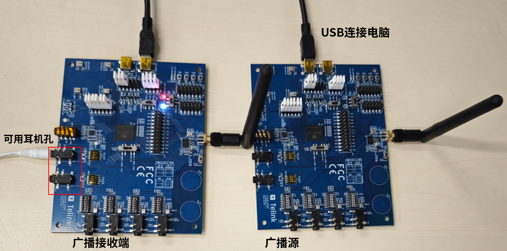
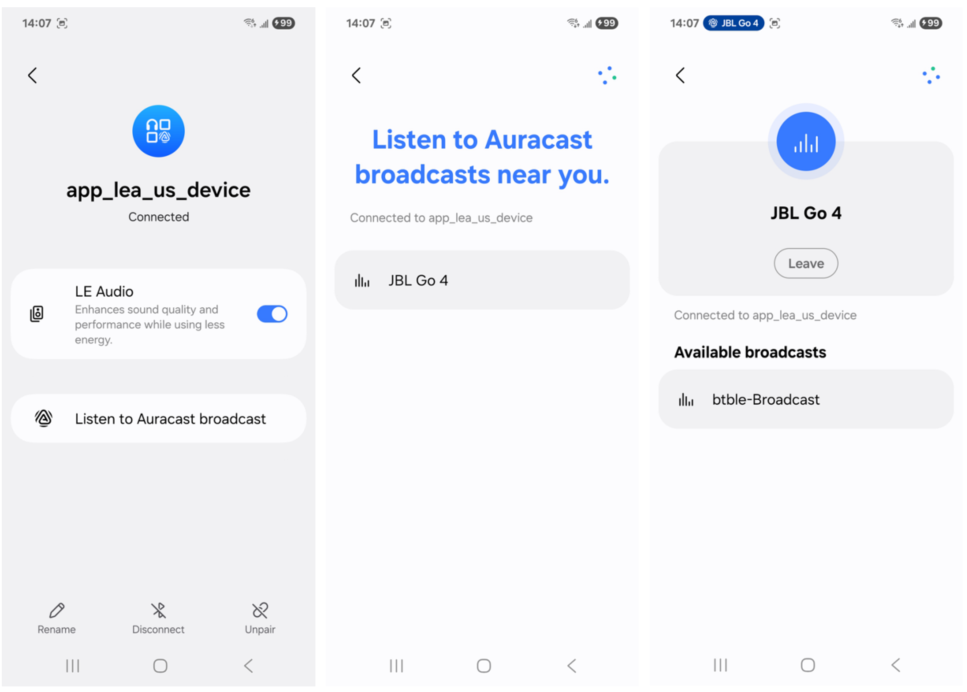
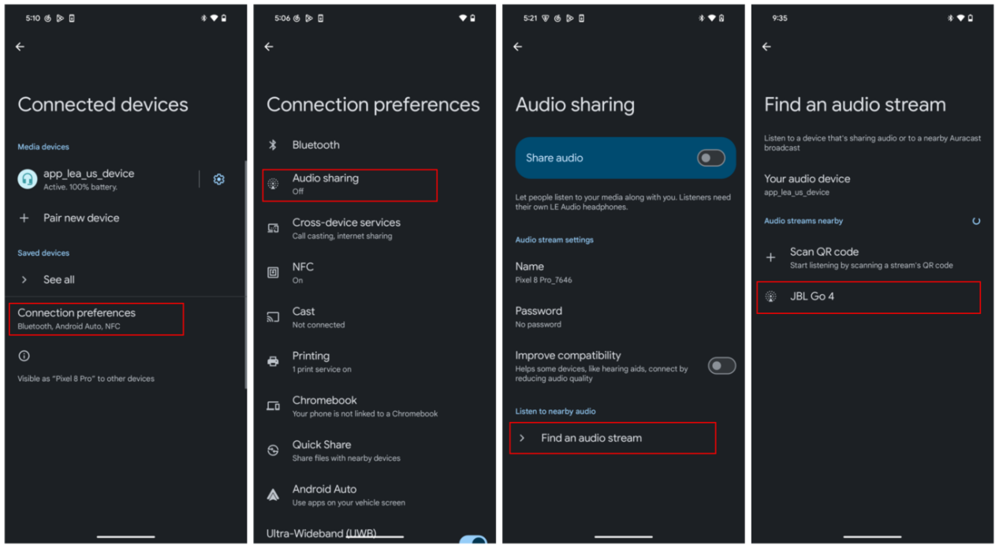

# LE Audio Broadcast Sink 示例应用使用指南

## 项目概述

本示例实现了基于泰凌（Telink）系列芯片的BLE LE Audio Broadcast Sink功能，作为蓝牙低功耗音频的广播接收器，主要功能是接收并解码来自LE Audio广播源的音频流，支持BIS (Broadcast Isochronous Stream)流接收和BIG (Broadcast Isochronous Group)同步。

## 快速开始

### 环境准备

- **开发板**：Telink支持的开发板系列，如TL751X、TL752X、TL721X等，详情请参考[Ble_example README_zh](../README_zh.md#支持的硬件) 和[Ble_example README_en](../README.md#hardware)

### 配置与编译

- **进入项目目录**：
   ```bash
   cd ./telink_b91m_bluetooth_src/tlk_bluetooth_src/vendor/ble_example/app_lea_broadcast_sink
   ```

- **配置参数**：
   在`app_lea_broadcast_sink_cfg.h`文件中，可根据需求调整以下配置参数：
   
   ```c
   #define APP_EXT_SCAN_ENABLE           1       // 启用扩展扫描
   #define APP_PERIODIC_ADV_SYNC_ENABLE  1       // 启用周期性广播同步
   #define APP_BIG_SYNC_ENABLE           1       // 启用BIG同步
   #define TLK_MW_LEA_BMR_ENABLE         1       // 启用广播多播路由
   ```

- **编译并烧录固件**

### 连接与运行

- **设备启动**：
   - 开发板上电后会自动进入默认的BIS_SYNC模式
   - 在BIS_SYNC模式下，设备会自动扫描并同步到Telink广播源(app_lea_broadcast_source demo)设备。([Boradcast Source Demo](../app_lea_broadcast_source/README.md))
   - 同步成功后，可听到广播音频播放
   

- **模式切换**：
   - 短按按键可在BIS_SYNC和BIS_SINK模式间切换
   - 连接广播按键与开发板对应关系为：9528A - SW2，TL751X - SW24，TL721X - SW4
   - 切换到BIS_SINK模式后，设备会开始广播，等待手机连接

- **SINK模式使用**：
   - 在SINK模式下，使用支持Auracast Assistant 手机连接设备。
   - 通过手机蓝牙界面，搜索连接后，配置想要同步的广播源。
   - 连接成功后，设备会接收并播放来自广播源的音频。

SINK模式下手机连接与广播源配置的操作演示:




