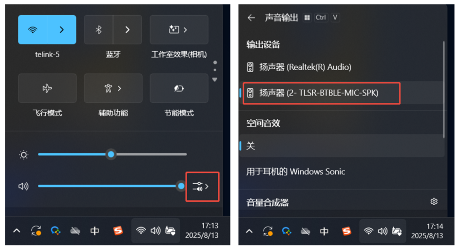

# LE Audio Broadcast Source

## 项目概述

LE Audio Broadcast Source是基于Telink蓝牙芯片平台开发的LE Audio广播源应用，实现了从USB设备/DMIC获取音频数据并通过BIS进行广播的功能。该应用支持多种音频流配置，可满足不同场景下的音频广播需求。

## 快速开始

### 环境准备

- **开发板**：Telink支持的开发板系列，如TL751X、TL752X、TL721X等，详情请参考[Ble_example README_zh](../README_zh.md#支持的硬件) 和[Ble_example README_en](../README.md#hardware)

### 配置与编译

- **代码配置**：
   - 打开`app_lea_broadcast_source_cfg.h`文件
   - 根据需要选择音频流配置（默认：BIS_STREAM_48kHz_96kbps）
   ```c
    // 广播配置
    #define APP_EXT_ADV_SETS_NUMBER       1
    #define APP_EXT_ADV_DATA_LENGTH       200
    #define APP_PERIODIC_ADV_SETS_NUMBER  1
    #define APP_PERIODIC_ADV_DATA_LENGTH  200

    // 音频流配置
    #define BIS_STREAM_48kHz_96kbps       1
    #define BIS_STREAM_48kHz_80kbps       2
    #define BIS_STREAM_32KHz_64Kbps       3
    #define BIS_STREAM_24KHz_48Kbps       4
    #define BIS_STREAM_CONFIG             BIS_STREAM_48kHz_96kbps

    // 功能使能
    #define TLK_MW_LEA_BMS_ENABLE         1
    #define LE_AUDIO_CODEC_INPUT_TYPE     LE_AUDIO_CODEC_TYPE_USB_AUDIO
    ```
   - 配置设备名称和其他参数
    ```c
    struct lea_broadcast_source_param param = {
        .device_name = "tlk_lea_broadcast_source",
    };
    lea_broadcast_source_open(&param, lea_broadcast_source_opened);
    ```
- **编译并烧录固件**：

### 运行与连接

-  **烧录固件**：将编译生成的固件烧录到Telink开发板
-  **设备连接**：
   - 使用USB数据线将开发板连接到计算机
   - 计算机将识别开发板为USB音频设备

   
   
-  **音频播放**：
   - 在计算机上播放音频文件
   - 开发板将通过BIS广播音频

-  **接收广播**：
   - 使用支持BIS SINK的设备搜索并连接到广播源([app_lea_broadcast_sink](../app_lea_broadcast_sink/README.md) 或者 [app_lea_device](../app_lea_device/README.md))
   - 设备将开始播放接收的音频
