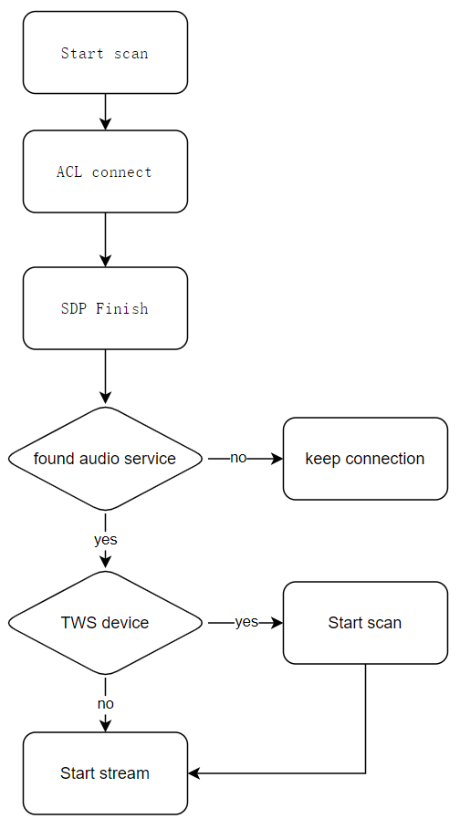
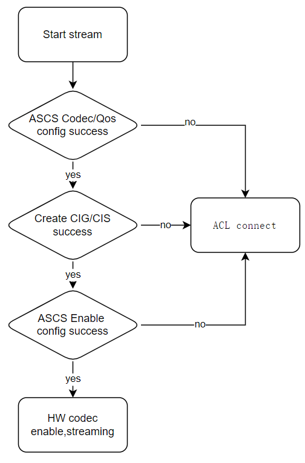

# LE Audio Unicast Client 示例应用使用指南

## 项目概述

本示例实现了基于泰凌（Telink）系列芯片的BLE LE Audio Unicast Client功能，作为蓝牙低功耗音频的客户端，用于与LE Audio Unicast Server设备建立连接并进行音频流传输。支持音乐播放、单向麦克风传输以及双向语音通话等多种音频应用场景。

## 快速开始

### 环境准备

- 泰凌（Telink）支持的开发板系列：TL751X、TL752X、TL721X等，详情请参考[Ble_example README_zh](../README_zh.md#支持的硬件) 和[Ble_example README_en](../README.md#hardware)

### 配置与编译

- **功能模式配置**
   根据目标应用场景，修改`app_lea_uc_ui.c`中的功能模式宏：
   
   ```c
   #define APP_UC_FUNCTION_SELECT_ITEM APP_UC_FUNCTION_MUSIC_PLAY  // 或 APP_UC_FUNCTION_MIC_ONLY 或 APP_UC_FUNCTION_VOICE_CALL
   ```

   - `APP_UC_FUNCTION_MUSIC_PLAY`：音乐播放模式
   - `APP_UC_FUNCTION_MIC_ONLY`：单麦克风模式
   - `APP_UC_FUNCTION_VOICE_CALL`：语音通话模式

- **编译并烧录固件**
   按照Telink SDK提供的方法烧录固件到开发板：
   - 连接开发板到电脑
   - 使用Telink IDE或命令行工具编译项目
   - 通过烧录工具将固件烧录到开发板

### 连接与运行

- **设备启动与扫描**
   - 开发板启动后会自动开始扫描附近的LE Audio设备
   - 扫描结果将根据RSSI值进行排序

- **设备连接**
   - 系统会自动连接信号最强的LE Audio Unicast server设备
   - 连接成功后，设备USB log 会打印相应的连接状态

   

- **音频流建立与传输**
   - 连接成功后会自动传输音频流到所连接的Unicast server设备
   - 根据选择的功能模式开始音频传输：
     - 音乐播放模式：发送音频数据到服务器
     - 单麦克风模式：接收来自服务器的麦克风音频
     - 语音通话模式：进行双向音频传输


