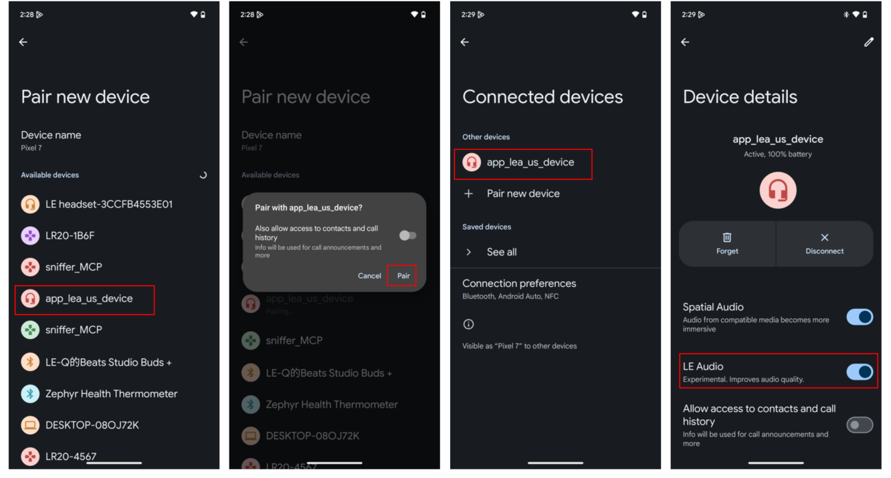
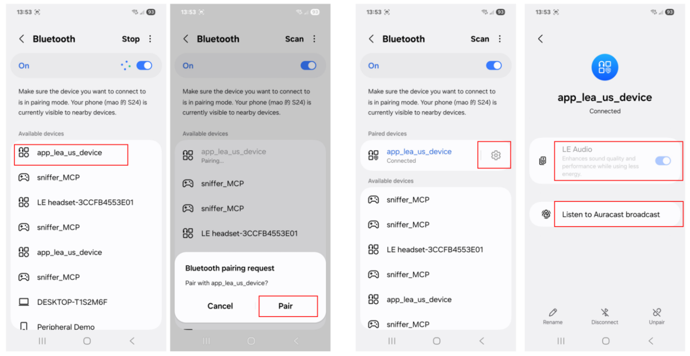
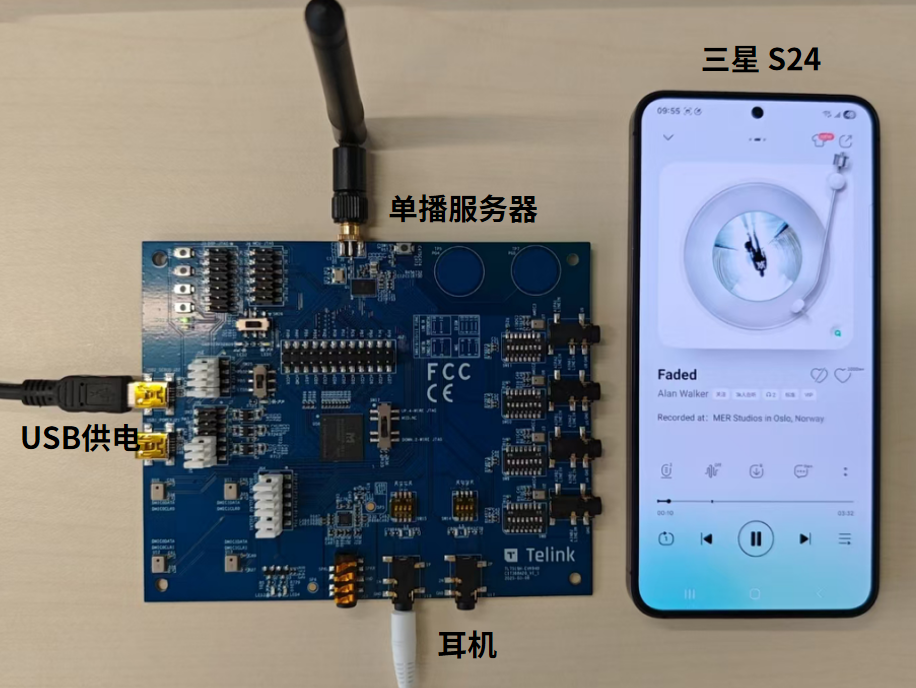

# LE Audio Unicast Server 示例应用使用指南

## 项目概述

本示例实现了基于泰凌（Telink）系列芯片的BLE LE Audio Unicast Server功能，支持Headset（单耳机）和TWS（真无线立体声）两种设备类型，实现低功耗蓝牙设备LE Audio规范定义的音频流传输服务，支持高质量音频播放和麦克风输入。

## 快速开始

### 环境准备

- 泰凌（Telink）支持的开发板系列：TL751X、TL752X、TL721X等，详情请参考[Ble_example README_zh](../README_zh.md#支持的硬件) 和[Ble_example README_en](../README.md#hardware)

### 配置与编译

- **设备类型配置**
   根据目标设备类型，修改`app_lea_us.c`中的设备类型宏：
   
   ```c
   #define LEA_US_HEADSET 0
   #define LEA_US_TWS 1
   #define LEA_US_DEVICE_TYPE LEA_US_HEADSET
   ```
   
   - `LEA_US_HEADSET`：配置为Headset模式
   - `LEA_US_TWS`：配置为TWS模式

- **设备参数配置**
   - Headset模式参数配置：
     ```c
     static struct tlk_mw_lea_cap_headset_param s_le_headset_param = {
         .device_name = "app_lea_us_headset",  // 设备广播名称
         .interval = 50,  // 扩展广播间隔（毫秒）
         .volume = 150,  // 初始音量（0~255）
     };
     ```

   - TWS模式参数配置：
     ```c
     static struct lea_us_tws_param s_le_tws_param = {
         .device_name = "app_lea_us_tws",  // 设备广播名称
         .interval = 50,  // 扩展广播间隔（毫秒）
         .volume = 150,  // 初始音量（0~255）
     };
     ```

- **TWS模式特殊配置**
   
   TWS模式（真无线耳机模式）有两个关键配置需求：
   
   - **左右耳标识**：
      - 耳机通过flash中的特定值来确定自身是左耳机还是右耳机
      - 需要在flash中添加相应的标记
      - 左耳标识：0x20，右耳标识：0x21
      - Flash地址：最后1M的F8000位置，如2M flash则在0x1F8000，8M flash在0x7F8000

   - **SIRK密钥配对**：
      - 一对耳机需要共用一个16字节的 SIRK（Set Identity Resolving Key）
      - 相同的 SIRK 标识一对耳机
      - 手机只需与其中一个耳机配对，就能自动连接到另一个耳机
      - Flash地址：Flash地址：最后1M的F8010位置，如2M flash则在0x1F8010，8M flash在0x7F8010

   - **注意**: SDK目前默认配置，左耳是主耳，右耳是副耳，主耳能被手机扫描连接，主耳被手机配对连接后，手机会自动连接副耳。第一次配对时，必须要同时完成左耳和右耳的配对，才能保证TWS模式正常工作。如果用户只配对了左耳并开始音乐播放，手机不能连接副耳并播放音乐。

- **编译与烧录**

### 连接与运行

- **设备启动与广播**
   - 将开发板通过USB数据线连接到电源
   - 设备启动后会自动开始扩展广播
   - 广播名称为配置中设置的`device_name`（默认："app_lea_us_headset"或"app_lea_us_tws"）

- **客户端连接**
   - 使用支持LE Audio的客户端设备（如pixel 7/Galaxy S24/Redmi K70 pro）搜索蓝牙设备
   - 在可用设备列表中找到对应的广播名称
   - 点击设备名称进行配对连接

以下是Google Pixel 7 和 三星S24手机连接 LE Audio Unicast Server 的操作步骤演示：





- **LE Audio配置与音频播放**
   - 连接成功后，在客户端设备上启用LE Audio功能
   - 打开音乐播放器或通话应用
   - 将音频输出设置为已连接的LE Audio设备
   - 开始播放音乐或进行通话，即可通过设备听到音频

将手机与音频设备连接，并完成低功耗音频（LE Audio）设置，将耳机插入音频设备的耳机接口，在手机上播放音乐，即可通过耳机听到音乐，如下图所示。


