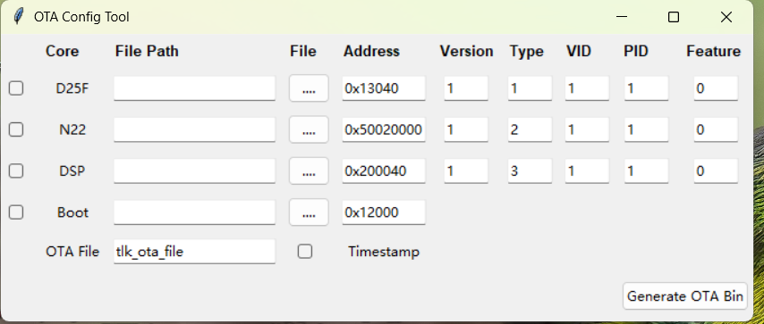
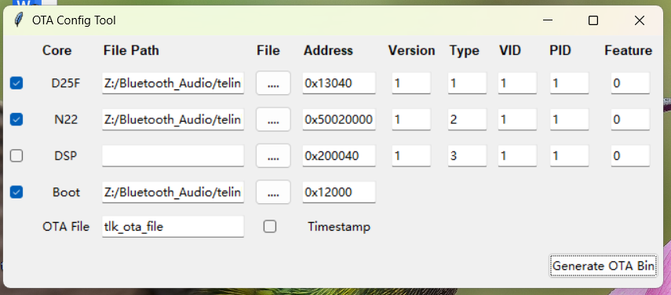
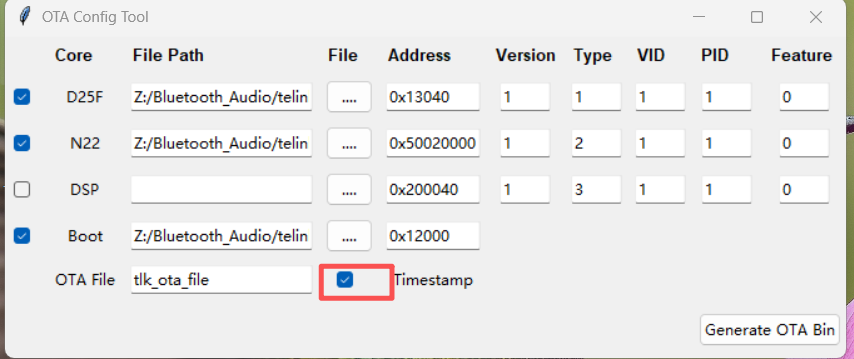

# BLE OTA Example

## Supported MCUs
| MCU Series | Board Model                                                    |
|------------|----------------------------------------------------------------|
| TL721x     | C1TXA104_V1.1(CODEC1-V2) <br> C1T315A20 <br> C1T315A20_V2       |
| TLSR952x   | C1T266A20_V1.3                                                 |
| TL751x     | C1T368A20_V1_1                                                 |

The SDK supports OTA (Over-the-Air) firmware update functionality. This example demonstrates how to implement OTA updates via a BLE GATT Server and integrate OTA capabilities into other BLE applications.

Typically, GATT Servers operate in the GAP ACL Peripheral role, which is the basis for this example. OTA updates can also be implemented in the GAP ACL Central role in practical scenarios.

## OTA Protocol and Workflow
For details on the SDK's OTA protocol and workflow, refer to the official Handbook documentation.

## BLE OTA Mobile Demo App
To obtain the OTA mobile application, contact your FAE (Field Application Engineer) or refer to the official Handbook documentation.

## BLE OTA Example Code Structure
To enable the SDK's OTA functionality, use the macro definition `TLK_MW_USER_CTRL_ENABLE`:
```c
#define TLK_MW_USER_CTRL_ENABLE       1
```

Register the BLE Telink OTA v2 Service and add OTA characteristics using the API `blc_svc_addOtaV2Group`:
```c
int INIT(APP_BLE_OTA_BLE)(void)
{
    blc_svc_addOtaV2Group();
    INIT(APP_BLE_ACL_PERIPHERAL)();

    tlk_printf("[APP] BLE OTA service initialized");
    return 0;
}
```

## BLE OTA Example Compilation and Flashing
The compilation method for OTA-enabled firmware is the same as for other BLE applications. The firmware to be flashed must be generated using the provided scripts.

The scripts are developed based on Python 3.7 or higher. Developers must first configure the Python environment. For detailed steps, consult AI.

The [OTA GUI Tool](../../../shell/ota/ota_gui.py) requires the Tkinter module, which is natively supported on Windows.

[OTA Script](../../../shell/ota/tlk_ota.py)

### OTA Script Usage
Modify the parameters in the script according to your actual requirements, then execute the script to complete the OTA update. Select `None` if a file is not needed.

```bash
python3 tlk_ota.py
# or
python tlk_ota.py
```

```python
d25f_bin = tlk_bin_file_info("ota/bt_interphone.bin", 0x13040, type=0x01)
n22_bin = tlk_bin_file_info("ota/bt_interphone_controller.bin", 0x50020000, type=2)
dsp_bin = tlk_bin_file_info("ota/dsp_audio_sdk_v0.1.0.2_for_ram_boot.bin", 0x200040, type=3)
```

### OTA GUI Usage
You can package the script into an executable file using Python's core tools. For specific methods, consult AI.

```bash
pyinstaller -F -W ota_gui.py
```

Alternatively, run the script directly each time:
```bash
python3 ota_gui.py
# or
python ota_gui.py
```

The OTA GUI interface is shown below. Users can select three types of firmware (D25F/N22/DSP) for updates based on the target MCU.

The "Address" value does not require modification. "Version" refers to the firmware version (used for system version management), with a default value of 1. The "Boot File" is optional—if provided, a combined Boot+OTA firmware will be generated, which can be flashed directly starting from address 0.

The default name of the generated OTA file is `tlk_ota_file.bin` (customizable). Checking the "Timestamp" option will append a timestamp to the OTA file name, facilitating version management during debugging.

Click the "Generate OTA" button to generate the OTA file.



For example, in the image below, D25F and N22 firmware are selected along with a Boot file. By default, two files will be generated: the OTA file and the combined Boot+OTA file, named `tlk_ota_file.bin` and `tlk_ota_file_with_boot.bin` respectively.



If the "Timestamp" option is checked, the generated file names will include a timestamp, e.g., `tlk_ota_file_2025-12-05 14-34-55.bin` and `tlk_ota_file_with_boot_2025-12-05 14-34-55.bin`.


